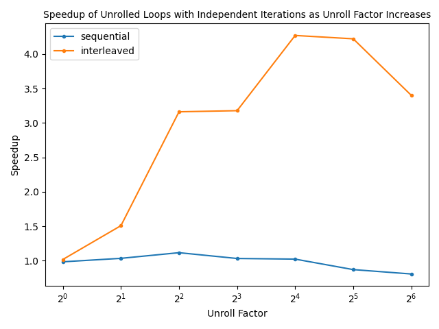
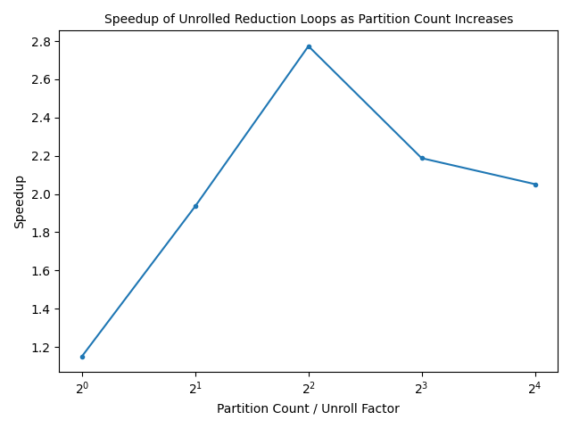

# Evaluation

## Independent Loops

As we can see in the above graph, interleaving independent iterations performs much much better than simply leaving them in sequential form after unrolling. We are compiling with O0, so this is likely because all the sequential unrolling accomplishes is removing the check (which was quite low cost) and reducing the number of branches (which were likely well-predicted anyway). The interleaving unrolling does both those things, but also orders the instructions such that there are fewer data dependencies, allowing the processor to execute more of the additions in parallel. 

In practice, the sequential unrolling seems to not do much better than the reference and the difference is negligible compared to our noise. We hypothesize that this is because I-cache performance is hurt enough (particularly as the unroll factor increases) to outweigh the benefits of removing branches and comparisons. As discussed before, the branches and comparisons are likely handled fairly well by the processor anyways, even on the reference loop. The interleaved unrolling gets better as unroll factor increases, until it hits 64 where it regresses a little. Notably, the regression is at the point where unroll factor equals chain length, which makes sense because chain length does bound parallelism somewhat. We could also be running into the processor's parallelism limit or over-pressuring the register pool or stack.

## Reduction Loops

The above graph showcases how initially increasing the partition size results in performance gains, but quickly leads to performance degradations when using eight or more partitions (it gets even worse past sixteen, too). The initial gains make sense, as the partitions allow for more parallelism per iteration and we also are removing branches and comparisons. That said, even these initial gains are much smaller than what we saw for independent loops. While independent loops had a smaller proportion of memory operations and more total parallelizable operations, the reduction loops' involve, per partition, reading and writing to memory with only one addition in between. This probably explains the lower peak performance improvement for unrolling reduction loops compared to unrolling independent loops.

The large performance degradation after the partition count passes four can probably be explained by the memory hierarchy. As the partition count increases, the effective working set increases, as the accumulators for each partition are all frequently accessed throughout the loop as well as the rest of each partition's region. Thus, we have more cache pressure and perform worse. Additionally, the more partitions we have, the more difficulty the prefetcher will have preloading in soon-to-be accessed blocks. When we only have one partition, for example, a streaming prefetcher would probably remove almost all misses. But, with many partitions, we have many different streaming access patterns interleaved, which may be much more difficult to accurately predict for the processor.
