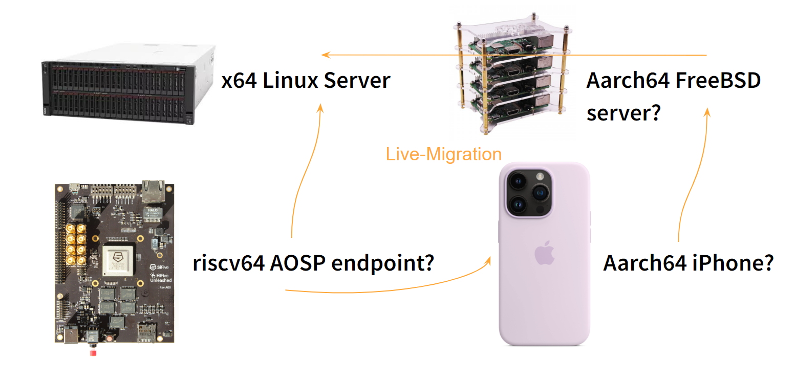
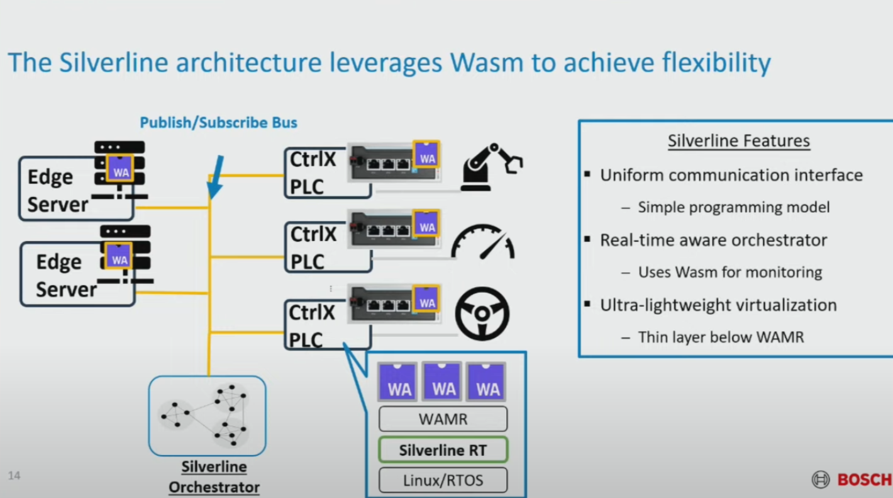
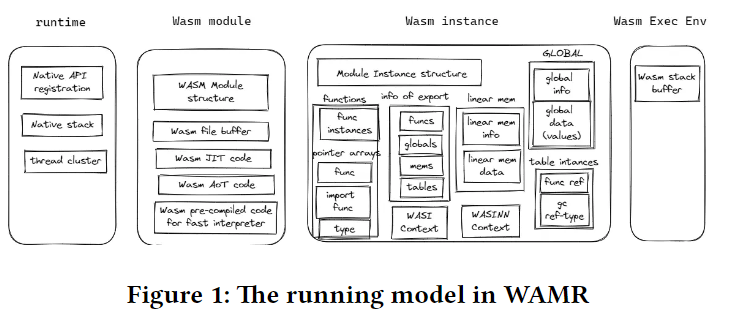
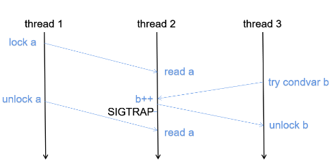

# Proposal for Cross Platform Migration Based on WebAssembly and WASI

The topic of migration in the scenario of heterogeneous binary offloading and remote resuming becomes a big problem. Say you a migrating the current process somewhere that has more power like the newest and greatest chip or operating system that has a better JIT-ed or AoT-ed native library code. Compared with prior work CRIU, we support heterogeneous ISA, heterogeneous kernel. Seamless migration in the context of heterogeneous device offloading and remote resuming poses several challenges. Some of the key challenges include:

1. Heterogeneous ISA (Instruction Set Architecture): Migrating processes across different instruction sets requires careful handling, as
   the target architecture may have different instruction encodings, register configurations, and memory layouts. One solution to this
   problem is to employ WAMR’s dynamic code JIT+memory JIT IR over webassembly techniques to convert the source code or inter-
   mediate representation to the target ISA.
2. Heterogeneous Kernel: Different operating system kernels may have different system call interfaces, internal data structures, and
   resource management policies. Wasi supports the system call in a musl manner that supports most of the underlying modern operat-
   ing systems. Different versions of native libraries: The migration process may involve moving from an environment with one version of a native
   library to another environment with a different version. In some cases, this can lead to incompatibilities or performance issues.
   State synchronization and Performance tradeoffs: During the migration process, maintaining input or process consistency be-
   tween the source and target environments is crucial. We have a selection for maintaining an input restart or process state restart whenever which part is faster. We target the LLVM Memory JIT state.
3. Security and privacy: Migrating processes across different environments can expose sensitive data and potentially introduce new
   security vulnerabilities. To address these concerns, data encryption and secure communication channels like TLS can be employed
   during the migration process to protect sensitive information.

Usage lies in the Smart Industry offloading or iPhone offloading chatbot to Vision Pro.

WebAssembly (Wasm) is a binary instruction format designed as a low-level virtual machine that runs code at near-native speed. It is a platform-independent format initially created to enable high-performance applications in web browsers. However, its potential extends beyond the browser, allowing for its use in other environments, such as IoT devices, edge computing, and server-side applications. Wasm supports a variety of higher-level programming languages, including C, C++, Rust, and more. WebAssembly System Interface (WASI) is a standardized system interface for WebAssembly modules. WASI aims to provide a consistent and secure API for Wasm applications to access system resources, such as file systems, network sockets, and system clocks. By defining a standardized interface, WASI allows Wasm modules to be portable across different platforms and operating systems.

We build our PoCs on the [wasm-micro-runtime(WAMR)](https://github.com/Multi-V-VM/wasm-micro-runtime/) project written in C++, where the CHECKPOINT_RESTORE with interpreter mode has already unstreamed, is an open-source WebAssembly (Wasm) runtime specifically designed for resource-constrained environments, such as IoT devices, edge computing, and embedded systems. This lightweight runtime enables developers to run WebAssembly applications efficiently and securely on various platforms with limited resources. The running model can be illustrated as below: In the wasm-micro-runtime (WAMR) project, there are different build configurations to enable various features and execution modes. The following options are related to the WebAssembly (Wasm) execution modes:

1. WASM_ENABLE_JIT: Just-In-Time (JIT) compilation is an execution mode where Wasm bytecode is compiled into native machine code at runtime using LLVM_JIT, right before execution. This approach allows for faster execution since the code is compiled and optimized specifically for the target system. However, it increases memory usage and startup time due to the compilation process. Enabling this option includes the JIT compiler in the WAMR build.
2. WASM_ENABLE_AOT: Ahead-Of-Time (AOT) compilation is an execution mode where Wasm bytecode is compiled into native machine code before runtime, typically during the build process or when the application is installed. This approach results in faster startup time and improved run-
   time performance since the code has already been compiled and optimized. However, the compiled code may be larger and less portable across different systems. Enabling this option includes the AOT compiler in the WAMR build.
3. WASM_ENABLE_FAST_JIT: Fast Just-In-Time (Fast JIT) compilation is a lighter version of the JIT compilation mode based on ASMJIT though the memory is applying LLVM_JIT. Each of these execution modes has its advantages and trade-offs, depending on factors such as startup time, runtime performance, memory usage, and code portability. Depending on the specific requirements of the target environment and application, we choose to operate on LLVM_JIT.

We focus on the AOT executions mode. The WebAssembly interpreter mode is easily implemented by snapshotting the C++ struct

In this project, all of the state recovery is based on the WebAssembly View I need to finish the remaining part:

1. AOT to AOT with the following challenge:

   1. Make infrastructure like gdb with break point dwarf that on every WebAssembly instruction set a break point to compare the semantic one by one with the interpreter mode. 

   2. Set the INT3+software implemented dwarf the instruction(self modifying code) on LLVM IR level, we think the stable point from the webassembly view lies in the LLVM label front and explicit stable mapping that adds memory fences which goes to one of our evaluation point how frequently should we insert the stable checkpoint point. like we need to insert explicit phi to mark the dataflow is not stale. The webassembly view assures every label start is stateless in the LLVM view, because the stack and heap are stored in another buffer so that everything is checkpointable at label start.

   3. 

      

      

2. Socket and Locks recovery:
   1. Normal record and replay style checkpoint and recovery
   2. For socket since we are using different machine for recovery, we couldn't just use socket reuse from linux, we will implement a gate way that  forward all the packets and can do rewriting for the packets source dest ip and can hijack everything to do the seamless migration of socket.
   3. 