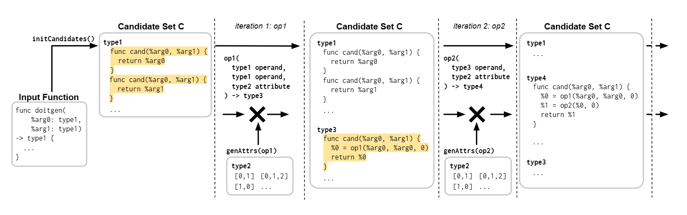
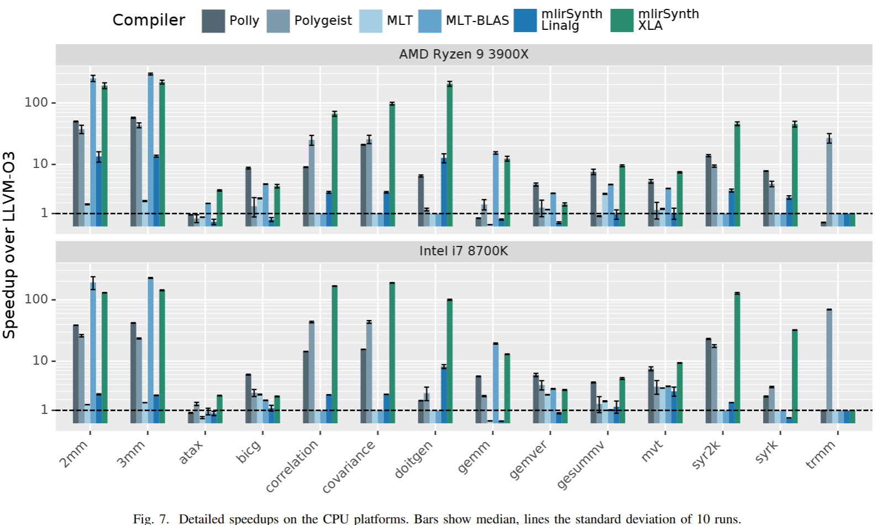
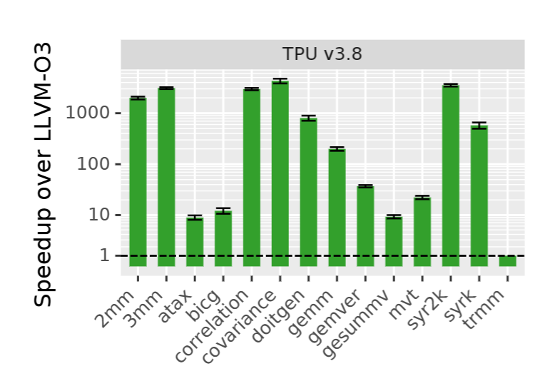

# MLIRSynth: Automatic, Retargetable Program Raising in Multi-Level IR using Program Synthesis

1. **Motivation**:
   - Problem Statement
     - The current compilation phase for the heterogenous devices like CPU GPU or TPU is too divergence and not high performance because of the lack of semantic translation when lowering the IR. 
     - 
     - MLIR is an infrastructure for developing domain-specific compilers. To aid this, MLIR provides reusable building blocks, especially the abstraction of dialects with a bunch of operator that has knowledge of cross device memory communication and predifined  and shared tools that allow us to define domain-specific languages and their compilation pipelines.
   
   - SoTA
     - Polygest has already fill what's done for multi dimensional to Dialects like Affine IR where we normally do auto CGRA/GPU/TPU codegeneration.
     - Google's HLO can do XLA just like jax or Chris Latner's Mojo is doing
     - LLVM Polly can do backend compilation with very good performance insight for single machine.
     - Linalg IR(By the way Linear Algebra extensions has been accepted from the c++26 community that maps the header to this primitive IR) has the insight from the mathematical view to transform the `matmul` and `transpose` to be only one time transpose.(together with many other mathematical optimization) And has the best insight to clear away the linear algebra residual dead primitive.
   - Motivation
   - 
     - LLVM IR/Affine IR/Linalg IR are too heterogenous in different ways. Sa HLO is a better way of raising from C++ to ML DSLs that is super useful for TPUs. Taking from the uniformed IR to a divergent but idompediency interms of dataflow(especially IO) and semantic to easily codegen to different dialects are super useful for current development for compiler to TPU/GPU/CPU extensions.
     - For Raising and Lowering actually impossible to embed the same logic with no information loss. Say I'm writing the predefined functions for an application, For cross platform optimization in MLIR is good for memory transpolation and compliance to different target's view from data movement perspective. If you are lowering to XLA.
     - For the impossible dimensions for compatibility, debug inforamtion and performance insight,
       Say, library that's been optimized out may be completely nonsense from a lowered IR perspective. If you don't have the knowledge of both IR, it's stupid abstraction.
     - DataFlow may be completely wrong, so we need residual IO spec generator to maintain the idompediency.
     - Compared with HAILE and fortran MLIR
   
2. **Compiler Solution - The MLIRSynth Framework - A virtual Compilation Phase abstraction**:

Heuristics: candidate set for getting the phi instruction out to match the set between target dialect and source dialect.
Soundiness: CBMC Z3 for determinating the correctness statically.

To extract φ (phi) with the candidate set, the algorithm follows a bottom-up synthesis approach. Here is a summary of the process:

1. Initialization: The algorithm starts by creating a candidate set (C) with valid candidates that produce distinct values from each other. This set includes candidates that return the arguments of the reference function (f) and simple constants.
2. Enumeration: The algorithm iterates through the set of operations in the grammar. For each operation, it identifies sets of possible operands, attributes, and regions based on the operation signature.
3. Candidate Generation: The algorithm generates possible candidates by taking the Cartesian product of sets of operands, attributes, and regions.
4. Candidate Checking: Each candidate in the set is validated using a series of static checks, ordered by complexity. These checks include type correctness and additional checks via dialects verification interface.
5. Equivalence Pruning and Validation: If the static checks succeed, the algorithm uses MLIR's execution engine to compile the candidate. It then checks φobsn by executing the candidate program (f') on a set of inputs and comparing the output value with the output value produced by the reference function (f).
6. Specification Checking: The algorithm checks if the candidate satisfies the specifications φ$_{obsn}$ and φ$_{obsN}$ by comparing the outputs of the candidate and the reference function on a small finite set of inputs (In) and a large finite set of inputs (IN), respectively.

3. **Illustrative Example**:

The above is from one dialect to the other

3. **Key Results**:

The evaluation over PollyBench on 8700k and 3990x summary tells us about the performance and effectiveness of the mlirSynth algorithm in raising programs to higher-level dialects within MLIR. The TPU performs well over LLVM for all(because LLVM is not a good IR for heterogenous accelerator) It provides information on the synthesis time, validity checks, and the impact of type information and candidate pruning on the synthesis process. The summary also mentions the performance improvement achieved by the raised programs compared to existing compilation flows, as well as the potential for further improvements and future work. 

3. **Discussion and Future Directions**:

- Benefits:
  
  - The bottom-up enumerative synthesis approach in MLIR allows for raising dialect levels within the MLIR framework.
  - The retargetable approach is applied to Affine IR, raising it to the Linalg and HLO IRs.
  - The raised IR code, when compiled to different platforms, outperforms existing compilation flows in terms of performance.
  
  Implications:
  
  - The use of polyhedral analysis in the compilation community has been extensively explored, but MLIR-Synth offers a different approach by using polyhedral analysis to raise dialect levels instead of lowering code.
  - The synthesis process in MLIR-Synth involves type filtering, candidate evaluation, and equivalence checking, which significantly reduces synthesis time compared to a naive algorithm.
  
  Future Work:
  
  - The authors plan to raise programs to multiple target dialects and improve the synthesis search by reusing previous program space explorations.
  - They also aim to integrate model checking into the synthesis process and evaluate raising to new and emerging dialects of MLIR.
  - The scalability of the synthesis algorithm will be improved to handle larger benchmark suites.

- The middle IR is always there for sure that is easier been developed from different angle but it's not the killer app for giving a new tool. The speed up from the tool is basically the backend that already has.